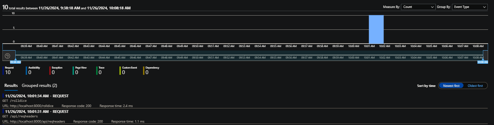

# zipkin

This example uses Docker Compose to create run 3 containers:
1. `otel-collector`: This uses an opentelemetry image with a custom `.yml` passed in to set up Azure Monitor (with App Insights) as the exporter
3. This uses the `/python/codeless` image in this repository to send telemetry to `otel-collector` via codeless instrumentation. You can replace this with any image of your choosing as long as it's set up properly to send telemetry to `otel-collector` via opentelemetry

Usage:
1. Run `export APPLICATIONINSIGHTS_CONNECTION_STRING="your_ai_connection_string"` from the terminal
2. Run `docker-compose up -d`
3. Make requests to the application
4. Navigate to your Application Insights instance on Azure to view telemetry

