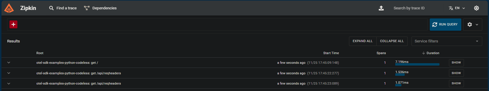

# zipkin

This example uses Docker Compose to create run 3 containers:
1. `otel-collector`: This uses an opentelemetry image with a custom `.yml` passed in to set up Zipkin as the exporter
2. `zipkin`: This uses a zipkin image as the telemetry backend to receieve telemetry from `otel-collector`
3. This uses the `/python/codeless` image in this repository to send telemetry to `otel-collector` via codeless instrumentation. You can replace this with any image of your choosing as long as it's set up properly to send telemetry to `otel-collector` via opentelemetry

Usage:
1. Run `docker-compose up -d` from within this project folder relative to `docker-compose.yml`
2. Make requests to the application
3. Navigate to `localhost:9411` to view traces in Zipkin

